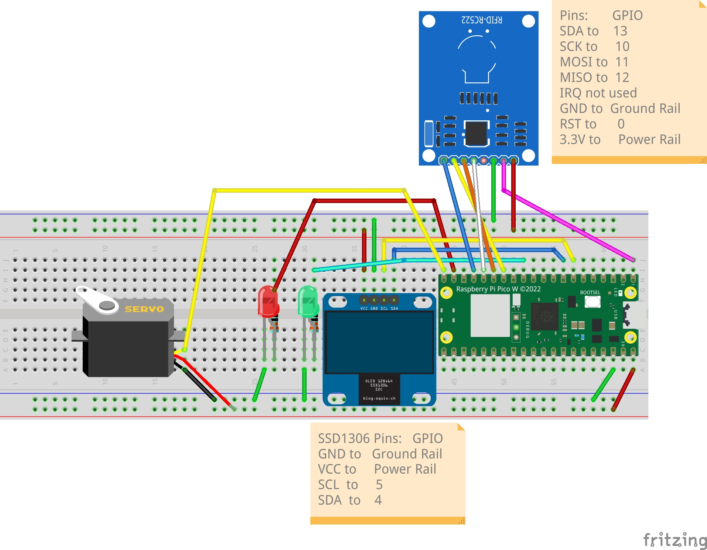

# RC522 Card Reader Control SG90 Servo
 RFID Card Reader To Control A Servo.
Author: Jason Sikes AKA [The Tech Rancher](https://www.youtube.com/@TheTechRancher)

Version: 1.0

Date Coded: 10/02/2023

Description: This circuit reads data from the RFID RC522 and Reads the position value of the SG90 Servo and displays either Locked or Unlocked status on the SSD1306 Display along with one of two LED's will light up. Red LED for Locked status or Green LED status for Unlocked. The MC is a Raspberry Pi Pico W.

License: [MIT License](https://github.com/TechRancher/RFID_Servo/blob/main/LICENSE)

## Wiring Diagram

## Include Libraries
You will need to include Libraries:
ssd1306.py
mfrc522.py

These libraries will need to be stored on the Raspberry Pi Pico W. I stored mine under lib. Pico W will look by default in the lib for any added libraries that the main.py would have asked to import.
